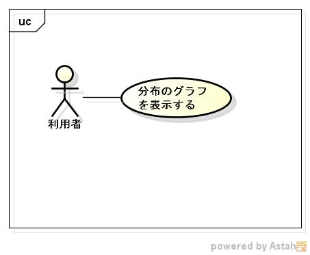

distgraph
=========
commons-math3を利用して、各分布のグラフを表示するプログラムです。

## Description ##

## Demo ##

## VS. ##

## Requirement ##
java11対応

## Usage ##
詳細は、
https://github.com/siranovel/distgraph/wiki

## install ##
    git clone https://github.com/siranovel/distgraph.git  
    cd distgraph/bin  
    tarファイルを解凍  

## Contribution ##

## Licence ##

[GPLv2](LICENSE)

## Author ##

[siranovel](https://github.com/siranovel)
